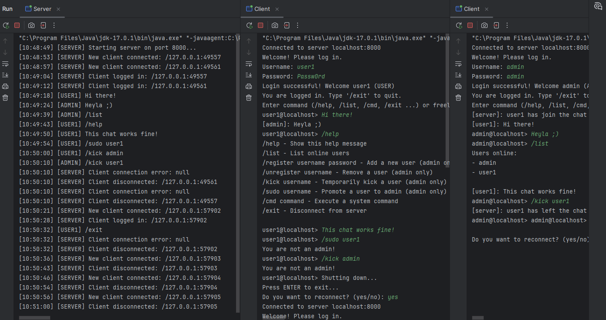

# Java Socket Terminal

> 💬 A simple Java client-server example using sockets, featuring real-time chat and command-line interactions in a terminal-style interface.

---

## 🚀 Overview

**Java Socket Terminal** is a lightweight demonstration of a Java-based socket application.  
It allows multiple clients to connect to a server and exchange messages in real time, while also supporting command-based input for shell-like interactions.

The project serves as a minimal yet expandable base for experimenting with network communication, threading, and simple command parsing.

<div align="center">
  
</div>

---

## 🧩 Features

- 🔌 Client-server communication via TCP sockets  
- 💬 Real-time multi-client chat  
- ⚙️ Command-line interface (supports `/help`, `/list`, `/exit`, etc.)  
- 🧵 Multithreaded server  
- 🪵 Basic logging in console  
- 🧱 Modular and easy to extend  

---

## 🗂️ Project Structure
```
src/
├─ server/
│ ├─ Server.java
| └─ ...
├─ client/
│ ├─ Client.java
| └─ ...
└─ common/
  └─ ...
```

---

## ▶️ How to Run

### 1️⃣ Start the server
```bash
javac src/server/Server.java
java src.server.Server
```

### 2️⃣ Start a client (in another terminal)
```bash
javac src/client/Client.java
java src.client.Client
```

### 💻 Example Session
```bash
> Connected to server
[Loris] Hello everyone!
[Server] Available commands: /help, /list, /exit
> /list
[Server] Connected users: Loris, Alice, Bob
```

### 🧠 Learning Goals
- Understand how TCP sockets work in Java
- Implement a multi-client chat system
- Create a simple shell-like command interpreter
- Practice threading and stream management

## 📜 License
This project is released under the [MIT License](LICENSE.txt)

## 👤 Author
**Loris Accordino**
💡 Passionate about computer science, technology, and learning through building things.
